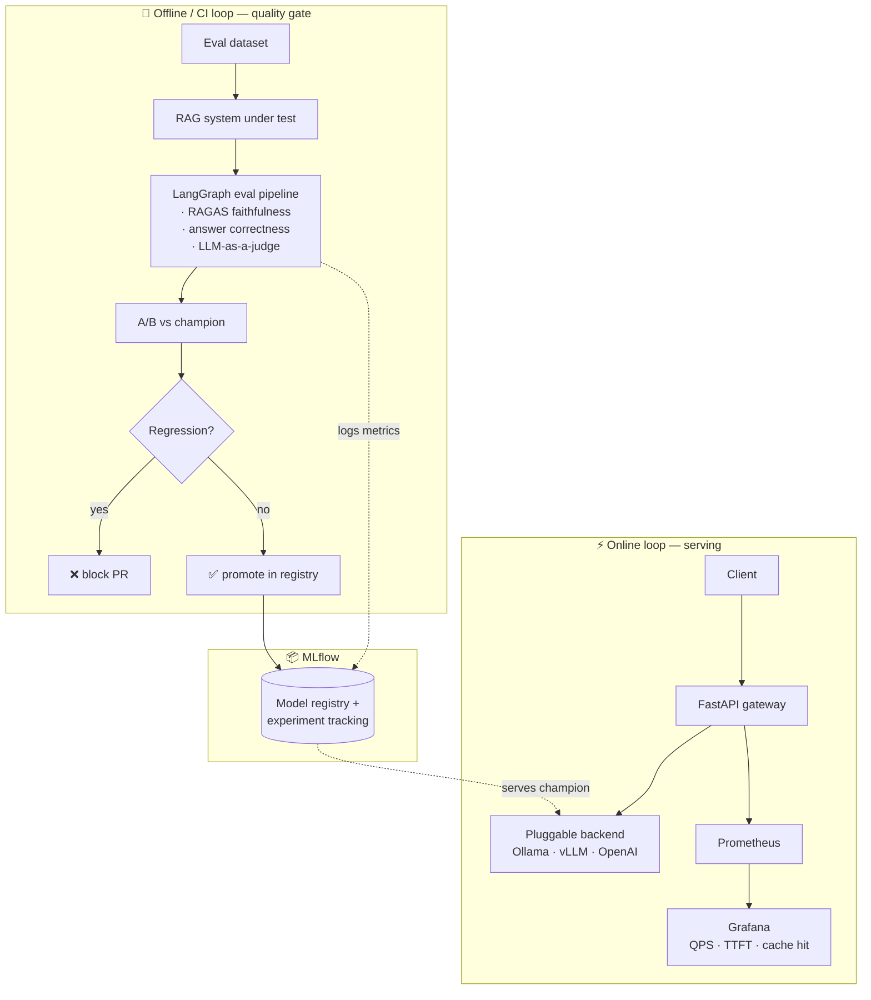

# ML Inference Platform

> An end-to-end LLM platform that treats **model quality as a CI gate**: no model or
> prompt reaches the serving layer unless it passes an automated, agentic evaluation —
> and once it's live, you can see exactly how it performs.

<p>
  
  
  
</p>

This repo connects two loops that every real LLM product needs but few side-projects show together:

1. **An agentic evaluation pipeline (offline / CI)** — built with **LangGraph**, scoring
   answers for **RAGAS faithfulness**, correctness, and **LLM-as-a-judge** helpfulness,
   with an **A/B harness** and a **GitHub Actions gate that blocks merges on regression**.
2. **A serving layer with full observability (online)** — a **FastAPI** gateway in front of
   a **pluggable inference backend** (Ollama locally, **vLLM** on GPU), with **Prometheus +
   Grafana** dashboards for QPS, TTFT, and cache hit rate.

**MLflow** sits between them as the registry/experiment store — the single source of truth
for "which model is the champion."

## Architecture



## Quickstart

**Prerequisites:** [`uv`](https://docs.astral.sh/uv/), Docker (for MLflow), and
[Ollama](https://ollama.com) with a small model pulled (`ollama pull llama3.2:1b`)
for local generation. Copy `.env.example` to `.env` and add your `ANTHROPIC_API_KEY`
(used by the eval judge).

```bash
# 1. Install (uv manages Python 3.11 + deps; no system changes)
make install

# 2. Bring up MLflow
make up          # -> MLflow UI at http://localhost:5000

# 3. Sanity check the config
uv run python -m mlip info

# 4. Try the RAG system under test (needs Ollama running locally)
uv run python -m mlip rag ask "Why does dropout improve generalization?"
uv run python -m mlip rag retrieve "bias variance tradeoff"
```

> The CLI is invoked as `python -m mlip` during development. (An installed
> `mlip` console script also exists for wheel installs.)

## Repository layout

| Path | Purpose |
|------|---------|
| [`mlip/serving/`](mlip/serving/) | FastAPI serving gateway + pluggable inference backends |
| [`mlip/rag/`](mlip/rag/) | The RAG question-answering system that is being evaluated |
| [`mlip/eval/`](mlip/eval/) | LangGraph eval pipeline: RAGAS, LLM-judge, A/B harness |
| [`mlip/cli.py`](mlip/cli.py) | The `mlip` command-line control plane |
| [`data/`](data/) | Curated eval dataset + document corpus |
| [`monitoring/`](monitoring/) | Prometheus config + Grafana dashboards |
| [`.github/workflows/`](.github/workflows/) | The CI quality gate |

## Tech stack

`FastAPI` · `LangGraph` · `RAGAS` · `MLflow` · `vLLM` / `Ollama` · `Prometheus` · `Grafana` · `Docker` · `GitHub Actions` · `uv` · `ruff`

## Build status

This project is built in vertical slices — each one is independently runnable.

- [x] **Slice 0** — Scaffold: structure, tooling, MLflow via Docker
- [x] **Slice 1** — RAG system under test + eval dataset
- [ ] **Slice 2** — LangGraph eval pipeline (RAGAS + judge) → MLflow
- [ ] **Slice 3** — A/B harness + champion tracking
- [ ] **Slice 4** — GitHub Actions quality gate
- [ ] **Slice 5** — Serving + Prometheus/Grafana observability
- [ ] **Slice 6** — Polish: diagrams, screenshots, real vLLM benchmark

## License

[MIT](LICENSE)
